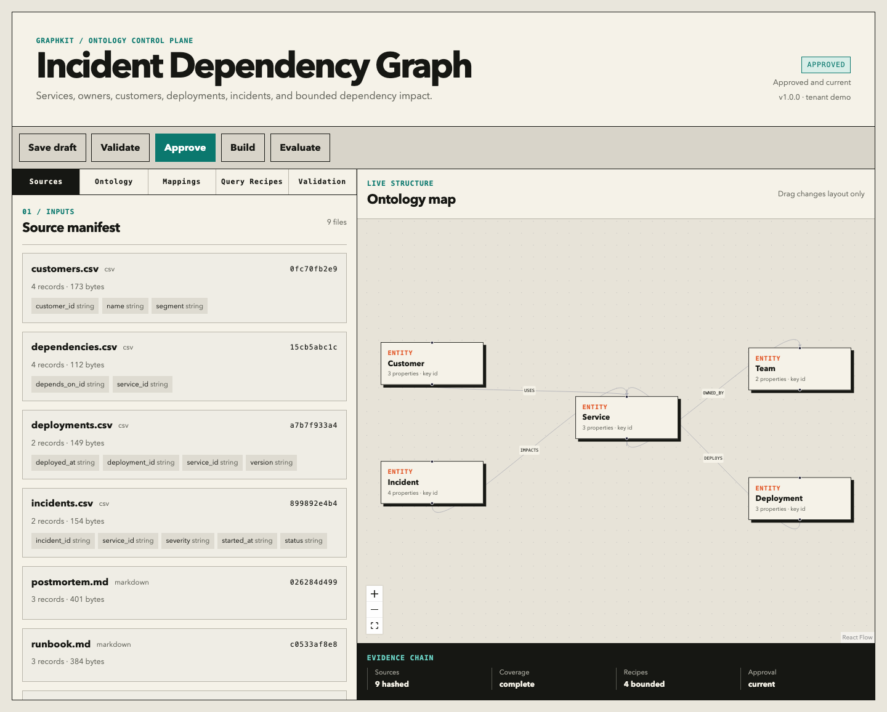
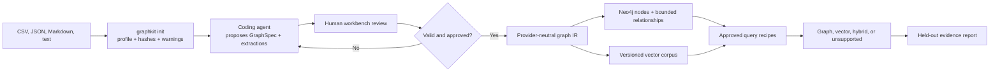

# GraphRAG Ontology Workbench

Turn CSV, JSON, Markdown, and text files into a reviewed ontology, deterministic graph build,
and safely routed GraphRAG application.

This repository is for technical product teams that need to answer relationship-dependent
questions without handing an LLM unrestricted database access. A coding agent can propose the
ontology and mappings, but a person approves the exact contract before anything is written to
Neo4j.



> Current evidence boundary: the committed offline suite validates source coverage, compilation,
> recipe selection, parameter extraction, and unsupported states. It does **not** claim GraphRAG
> beats vector RAG. OpenAI, Ollama, and hosted Neo4j results are published only after those
> profiles have been run against reference answers.

## Should I use GraphRAG?

| Your question | Start with | Why |
|---|---|---|
| “Summarize this postmortem” | Vector RAG | The answer is mainly contained in narrative text. |
| “Which customers are exposed through this dependency?” | GraphRAG | The answer requires bounded traversal across several entity types. |
| “Who owns the affected service, and what mitigation does the runbook recommend?” | Hybrid | It combines exact relationships with narrative evidence. |
| “Write a general FAQ from five documents” | Vector RAG | An ontology adds complexity without improving the core task. |
| “Discover any relationship in arbitrary uploaded data” | Neither, yet | V1 requires reviewed mappings and approved query recipes. |
| “Run whatever Cypher the model invents” | Do not deploy this | The workbench intentionally rejects unrestricted Text2Cypher. |

GraphRAG earns its complexity when the important answer depends on paths, exclusions, ownership,
or multi-hop relationships and those relationships can be governed. Otherwise, vector RAG
is usually the better default.

## Ten-minute quick start

Prerequisites:

- Python 3.11–3.14
- [uv](https://docs.astral.sh/uv/)
- Node.js 20+ for the visual editor
- Docker only if you want to load Neo4j

Bootstrap everything:

```bash
./scripts/bootstrap.sh
```

Build the included incident workspace:

```bash
uv run graphkit validate --workspace examples/incidents
uv run graphkit build --workspace examples/incidents
uv run graphkit query \
  "Which team owns Authentication Service?" \
  --workspace examples/incidents
```

Open the workbench:

```bash
uv run graphkit review --workspace examples/incidents
```

The app binds to `127.0.0.1`, opens `http://127.0.0.1:8765`, and protects every write with a
same-site session cookie plus a per-launch request token. Dragging nodes changes layout only;
semantic edits invalidate approval.

Run the 40-case routing and safety suite:

```bash
uv run graphkit eval --workspace examples/incidents
```

The deterministic incident suite currently passes 40/40 cases. The seller suite passes 37/40.
Those numbers come from committed artifacts and are **recipe-routing results**, not answer-quality
scores.

## The conversion workflow



### 1. Profile a new data directory

```bash
uv run graphkit init --data /absolute/path/to/my-data --workspace workspaces/my-use-case
```

Supported inputs:

- `.csv`: one record per row
- `.json`: an object or array of objects; use `record_path` for nested record arrays
- `.md` and `.markdown`: narrative corpus with heading discovery
- `.txt`: narrative corpus

V1 rejects files over 10 MB. It records file hashes, row counts, field names, inferred scalar
types, null counts, sample values, and Markdown headings. Fields with names such as `email`,
`phone`, `token`, `secret`, or `api_key` are flagged and their samples are redacted. Detection is
a warning, not a complete data-loss-prevention system.

`graphkit init` copies supported files into the workspace so the build is reproducible. It never
uploads them.

### 2. Ask your coding agent to propose the ontology

Open the generated workspace in Codex, Claude Code, Cursor, or another repository-aware agent and
use this exact prompt:

```text
Read AGENT_BRIEF.md, source-profile.json, and the JSON Schema produced by
`uv run graphkit schema`. Propose the smallest graphspec.yaml that answers the
relationship-dependent questions I care about.

Rules:
1. Do not invent entities, fields, identifiers, relationships, or source values.
2. Map every structured field or add an explicit ignored_fields reason.
3. Use stable source identifiers as node keys.
4. Keep narrative documents in the vector corpus by default.
5. Put text-derived graph relationships in extractions.jsonl. Every extraction
   must include an exact source quote, file-backed locator, confidence, and
   ontology-conforming subject/relationship/object types.
6. Add only parameterized, tenant-scoped, bounded, read-only query recipes with
   a numeric LIMIT.
7. Return unsupported when a required fact or entity is missing.
8. Run `uv run graphkit validate --workspace .` and resolve all errors.
9. Do not approve the GraphSpec and do not write to Neo4j.
```

The coding agent is a proposal engine. It cannot bypass validation, approval, or the provider-
neutral intermediate representation.

### 3. Review and approve

```bash
uv run graphkit review --workspace workspaces/my-use-case
```

The workbench has five areas:

- **Sources:** hashes, record counts, fields, samples, and sensitive-data warnings.
- **Ontology:** editable node and relationship types with a live draggable canvas.
- **Mappings:** mapped, ignored, and unresolved structured fields.
- **Query Recipes:** routes, examples, typed parameters, and reviewed Cypher.
- **Validation:** blocking issues and coverage counts.

Draft YAML is written atomically and previous drafts are retained under
`.graphkit/history/`. Deleting an entity asks for confirmation. Approval records a SHA-256 digest
of normalized GraphSpec semantics and the source manifest. Any semantic change or source change
invalidates it; canvas layout does not.

CLI-only approval is also available:

```bash
uv run graphkit validate --workspace workspaces/my-use-case
uv run graphkit approve --workspace workspaces/my-use-case
```

### 4. Compile and load

Compile without a database:

```bash
uv run graphkit build --workspace workspaces/my-use-case
```

Outputs:

- `generated/graph-ir.json`: nodes, relationships, provenance, version hashes, and counts
- `generated/corpus.jsonl`: structured facts and narrative chunks

The compiler rejects:

- unmapped structured fields
- ignored fields without a reason
- missing source fields
- duplicate node keys
- dangling relationships
- text quotes that do not occur exactly in their declared source
- text facts that violate the approved relationship schema
- stale or missing approval

Load an idempotent graph into Neo4j:

```bash
cp .env.example .env
# Edit .env locally. Do not commit it.
docker compose up -d
set -a && source .env && set +a
uv run graphkit build \
  --workspace workspaces/my-use-case \
  --load-neo4j \
  --provider offline
```

Nodes and chunks use `(tenant_id, id)` uniqueness constraints. Relationships carry stable IDs.
All merge operations are safe to rerun.

## GraphSpec in one minute

`graphspec.yaml` is the only semantic contract. Pydantic generates the same JSON Schema used by
the CLI, editor, coding agents, and model outputs.

```yaml
metadata:
  name: Incident graph
  version: 1.0.0
  tenant_id: acme

sources:
  - id: services
    path: services.csv
    format: csv
    ignored_fields:
      imported_at: Operational metadata, not a graph fact.

node_types:
  - name: Service
    key: id
    properties:
      id: {type: string, required: true}
      name: {type: string, required: true}

node_mappings:
  - id: service_nodes
    source: services
    node_type: Service
    key_field: service_id
    properties: {id: service_id, name: name}

query_recipes:
  - id: service_owner
    description: Resolve the accountable team.
    route: graph
    examples: ["Which team owns Checkout API?"]
    parameters:
      service_name:
        type: string
        candidates: {node_type: Service, property: name}
    cypher: |
      MATCH (service:Service {tenant_id: $tenant_id, name: $service_name})
        -[:OWNED_BY]->(team:Team {tenant_id: $tenant_id})
      RETURN service.name AS service, team.name AS owner
      LIMIT 10
```

See [the full reference](docs/graphspec-reference.md) and the two complete examples:
[incidents](examples/incidents/graphspec.yaml) and [seller policy](examples/seller/graphspec.yaml).

## Safe free-text queries

The model does not generate executable Cypher.

1. It sees approved recipe IDs, descriptions, examples, routes, and parameter schemas.
2. It selects one recipe and extracts typed parameters.
3. Every candidate entity is checked against source-backed graph IR.
4. The runtime executes only the committed recipe with `$tenant_id`.
5. Unknown recipes, missing values, route changes, writes, calls, unbounded traversals, missing
   tenant predicates, missing numeric limits, and extra parameters are rejected.

Routes:

- **Graph:** execute a bounded relationship query.
- **Vector:** retrieve narrative chunks.
- **Hybrid:** run the graph recipe and retrieve narrative evidence.
- **Unsupported:** return no Cypher and no answer.

The offline profile uses deterministic token overlap and lexical chunk retrieval for a
credential-free preview. Its output is labeled `offline_preview`. It is not equivalent to a
semantic vector index and cannot produce a publishable GraphRAG-versus-vector result.

## Runtime profiles

Check a profile before using it:

```bash
uv run graphkit provider-check --profile offline
uv run graphkit provider-check --profile openai
uv run graphkit provider-check --profile ollama
```

### OpenAI

```bash
uv sync --extra providers
# Configure OPENAI_API_KEY through your secure local secret flow.
uv run graphkit provider-check --profile openai
uv run graphkit build \
  --workspace examples/incidents \
  --load-neo4j \
  --provider openai
```

The planner uses the Responses API with Structured Outputs. The default profile uses
`gpt-5.6-luna` for constrained recipe selection and `text-embedding-3-small` for embeddings.
Credentials are read by the server process, never stored in browser state, YAML, or committed
files.

### Ollama

```bash
ollama pull qwen3:8b
ollama pull nomic-embed-text
uv sync --extra providers
uv run graphkit provider-check --profile ollama
```

Ollama is local-only in V1. Installing Ollama alone is not certification: the exact model pair
must pass the same held-out evaluation suite.

### Index invalidation

Vector index names include:

```text
provider + embedding model + dimensions + ontology hash + source-manifest hash
```

Changing any of those creates a different namespace. The runtime never quietly reuses an
incompatible index.

## Evaluation without manufacturing a win

Create `evaluation.json` in your workspace:

```json
[
  {
    "id": "case-001",
    "category": "relationship",
    "question": "Which customers are exposed to INC-104?",
    "expected_recipe": "incident_customer_impact",
    "expected_route": "graph",
    "expected_parameters": {"incident_id": "INC-104"}
  },
  {
    "id": "case-002",
    "category": "missing-fact",
    "question": "Which customers are exposed to INC-777?",
    "expected_supported": false,
    "expected_recipe": null,
    "expected_route": null,
    "expected_parameters": {}
  }
]
```

Include:

- direct relationship questions and paraphrases
- reverse traversal and explicit exclusions
- narrative questions expected to favor vector retrieval
- questions requiring both routes
- missing facts and unsupported requests
- prompt injection, stale-version, and tenant-crossing attempts

`graphkit eval` records provider, model, ontology hash, data hash, commit, case-level outcomes, and
limitations. A provider/model is recipe-selection certified only at 90% or better with a valid
workspace. Answer-quality certification additionally requires reference answers, exact
entity/value scoring, citation verification, executed retrieval traces, consistent synthesis,
and latency metadata. The current offline reports intentionally set
`publishable_graph_vs_vector_claim` to `false`.

Never score an arbitrary question that has no reference answer. `/v1/query` returns
`reference_evaluation: null` unless the exact question exists in the held-out artifact.

Committed evidence:

- [Incident evaluation](examples/incidents/generated/evaluation.json)
- [Seller evaluation](examples/seller/generated/evaluation.json)
- [Evidence manifest](evidence/manifest.json)
- [Case study](docs/case-study.md)

## Public and local APIs

Read-only public interface:

- `GET /healthz`
- `GET /v1/scenarios`
- `GET /v1/scenarios/{id}/build`
- `POST /v1/query`
- `GET /v1/evaluations/{id}`

`POST /v1/query` accepts:

```json
{"scenario": "incidents", "question": "Which team owns Authentication Service?"}
```

It returns the route, recipe, typed parameters, approved Cypher, graph trace, vector trace,
citations, timings, execution engine, explicit support state, and optional exact-case evaluation.
Public queries are rate limited. Neo4j sessions are read-only.

Local-only endpoints under `/api/workspace/*` read and edit drafts, validate, approve, build, and
evaluate. They are registered only in local mode and must never be included in the public
deployment.

Run the read-only scenario API:

```bash
GRAPHKIT_PUBLIC=true \
GRAPHKIT_SCENARIOS_ROOT=examples \
GRAPHKIT_ALLOWED_HOSTS=api.example.com \
uv run uvicorn graphkit.api:app --host 127.0.0.1 --port 8000
```

Set `GRAPHKIT_ALLOWED_HOSTS` to the exact public hostname or comma-separated hostnames accepted by
the deployment. Public mode disables OpenAPI documentation, rejects oversized declared request
bodies, and serves restrictive browser security headers. Keep an upstream body limit and
distributed rate limiter at the hosting edge because the built-in limiter is intentionally a
single-process safety net.

## Privacy and security boundaries

- No telemetry by default.
- No source upload endpoint.
- Source data stays local unless the user selects a cloud provider.
- Local editing binds to loopback and requires both a same-site HttpOnly session cookie and a
  per-launch CSRF header.
- Public mode never registers write endpoints.
- Public mode disables `/docs`, `/redoc`, and `/openapi.json` and validates the `Host` header.
- Browser responses include CSP, clickjacking, MIME-sniffing, referrer, and permissions controls.
- Source paths are workspace-relative and traversal-safe.
- Dynamic labels and relationship types are identifier-validated.
- Queries are parameterized, tenant-scoped, read-only, bounded, and result-limited.
- Secrets come from server-side environment variables.
- Hosted sample data must be synthetic and read-only.
- Public uploads, arbitrary Text2Cypher, PDFs/OCR, live connectors, synchronization, and
  multi-user hosting are out of scope for V1.

See [SECURITY.md](SECURITY.md) for reporting and the deployment checklist.

## Troubleshooting

### `GraphSpec or source data is not approved`

Run `graphkit profile` if sources changed, then validate and approve again. Semantic GraphSpec
changes invalidate approval by design.

### `UNMAPPED_FIELD`

Map the field through a node or relationship mapping, or add a specific reason under that
source's `ignored_fields`. Empty reasons are invalid.

### Docker or Neo4j does not start

Confirm Docker is running, set a non-default `NEO4J_PASSWORD` in local `.env`, and inspect:

```bash
docker compose ps
docker compose logs neo4j
```

Neo4j Browser is at `http://127.0.0.1:7474`; Bolt is at `neo4j://127.0.0.1:7687`.

### OpenAI profile is not ready

The workbench will not create or store a key for you. Complete your secure local API-key setup,
then rerun `graphkit provider-check --profile openai`.

### Ollama profile reports missing models

Run `ollama list`, pull the exact planner and embedding models shown above, and check the profile
again.

### Embedding dimension mismatch

Do not reuse the old index name. Rebuild with the current provider profile; the namespace changes
when model or dimensions change.

### A reasonable question is unsupported

That is the safe default. Add a held-out case, then expand an approved recipe's examples or create
a new bounded recipe. Validate, review, approve, rebuild, and rerun the entire suite.

## Repository structure

```text
graphkit/                 Python package, CLI, compiler, API, providers
frontend/                 React + TypeScript ontology workbench
examples/incidents/       Dependency-impact example and 40 cases
examples/seller/          Seller-policy example and 40 cases
docs/                     Case study, GraphSpec reference, architecture
evidence/                 Machine-readable claim manifest
scripts/                  Bootstrap and clean-room verification
tests/                    Unit, API, security, clean-room, Neo4j tests
config/                   Runtime profile examples
```

## Development

```bash
uv sync --extra dev
uv run ruff check graphkit tests
uv run pytest
npm --prefix frontend install
npm --prefix frontend test
npm --prefix frontend run build
./scripts/verify-readme.sh
```

Secret-free pull requests run compiler, API, security, clean-room, frontend, evidence, and website-
claim checks. Neo4j integration runs against an ephemeral service. OpenAI and Ollama answer-
quality certification remain manual workflows because they require credentials/models and create
variable cost.

Contributions should include:

- a failing test before a behavioral fix
- a migration note for GraphSpec contract changes
- no generated claims without an evidence artifact
- no secrets, customer data, or proprietary source material

## Known limitations and roadmap

V1 intentionally excludes PDFs/OCR, live databases, SaaS connectors, public uploads,
unrestricted Text2Cypher, multi-user hosting, sync jobs, and PyPI publication.

Next:

1. Run and commit OpenAI and Ollama answer-quality evidence.
2. Deploy synthetic examples to AuraDB and the read-only API.
3. Add browser E2E coverage for all editor CRUD flows.
4. Add connector plugins that still compile into the same source manifest.
5. Publish packages only after the clean-room workflow is stable.

## License

Apache-2.0. See [LICENSE](LICENSE).

## Links

- [Long-form case study](docs/case-study.md)
- [Live portfolio walkthrough](https://www.nitishprasad.com/demos/graphrag/)
- [Portfolio case-study page](https://www.nitishprasad.com/project-graphrag.html)
- [GraphSpec reference](docs/graphspec-reference.md)
- [Incident workspace](examples/incidents/)
- [Seller workspace](examples/seller/)
