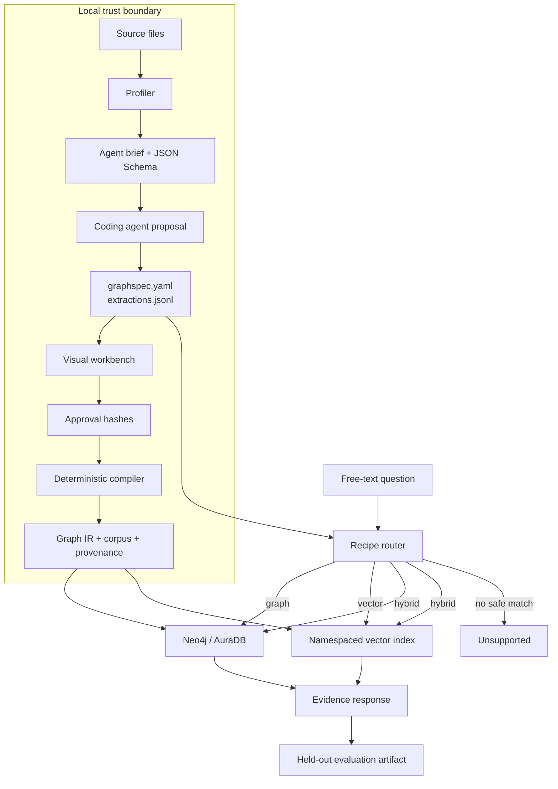

# GraphRAG Ontology Workbench: from fixed demo to falsifiable product

## Executive conclusion

The first seller-ontology demo illustrated a useful architecture, but it did not prove that
GraphRAG improved an answer. Its questions were fixed, outputs were predetermined, Cypher was
shown without being the source of the response, and comparison scores were simulated. The
rebuild turns that critique into the product.

GraphRAG Ontology Workbench profiles CSV, JSON, Markdown, and text; gives coding agents one
schema-backed proposal task; requires human review; compiles an approved, provider-independent
graph; loads Neo4j idempotently; routes free text only through approved recipes; and produces
case-level evidence.

The measured conclusion is deliberately narrow:

- Both example workspaces map 100% of structured fields or explicitly ignore them.
- The incident workspace compiles 17 nodes, 17 relationships, and 36 corpus chunks.
- The seller workspace compiles 33 nodes, 53 relationships, and 87 corpus chunks.
- The credential-free recipe-routing suite passes 40/40 incident cases and 37/40 seller cases.
- Those results validate routing and parameter extraction only.
- No committed artifact yet establishes a GraphRAG-versus-vector answer-quality winner.

GraphRAG is justified when an answer depends on governed multi-hop structure. Vector RAG remains
the default for document summary and explanation. Hybrid retrieval is useful only when both are
needed.

## 1. Original problem and prototype critique

The original prototype had a sensible ontology: sellers, programs, policies, fees, eligibility
rules, and regions. It also included tenant-aware Cypher and a trace-shaped UI. Those ideas were
worth preserving.

The problem was the evidence path.

1. A fixed question led to a fixed answer, so the interface could not demonstrate general
   retrieval behavior.
2. The page displayed Cypher, but the response was not proven to come from executing it.
3. The vector baseline was deterministic simulation rather than retrieval from the same source.
4. Scores were presented without a reference-answer artifact and reproducible judge inputs.
5. One curated seller dataset could not demonstrate that the conversion method generalized.

The prototype therefore showed “what a GraphRAG system might look like,” not “when this system
earns its complexity.”

The workbench preserves the ontology discipline, bounded queries, provenance, and tenant
boundaries. It removes every hard-coded quality claim.

## 2. Product hypothesis

Before implementation, the product split questions into three falsifiable groups.

**Graph-favored questions** require relationship traversal:

> Which customers are exposed to INC-104, through which dependency, and which team owns the
> nearest failing service?

The answer crosses Incident → Service, reverse dependency paths, Customer → Service usage, and
Service → Team ownership. Flattening that path into chunks can work, but it requires duplicating
and maintaining derived prose.

**Vector-favored questions** live primarily in narrative:

> Summarize the mitigation steps in the Order Ledger postmortem.

A graph can encode individual actions, but doing so adds modeling cost without an obvious
accuracy benefit.

**Hybrid questions** require both:

> For INC-104, who owns the failing service and what mitigation does the runbook recommend?

The owner is an exact relationship. The mitigation is cited narrative evidence.

Success criteria were set before provider evaluation:

- 100% structured-field coverage
- zero dangling relationships
- zero unverifiable extracted quotes
- zero write queries, unbounded traversal, or tenant crossover
- at least 90% recipe-selection accuracy for a supported provider/model
- at least 90% exact entity/value correctness on a future executed relational suite
- actual graph, vector, hybrid, failure, and tie results published without requiring GraphRAG to
  win

## 3. Reusable conversion workflow

### Profile

`graphkit init` copies supported sources into a reproducible workspace and records file hashes,
formats, field types, samples, headings, and sensitive-field warnings.

### Propose

A repository-aware coding agent reads `AGENT_BRIEF.md`, the profile, and generated JSON Schema.
It proposes `graphspec.yaml` and optional `extractions.jsonl`. It cannot approve the result or
write to Neo4j.

### Review

The local React workbench renders forms for semantics and React Flow for structure. The canvas is
visualization, not the semantic editing surface. Users resolve unmapped fields, review every
query recipe, and approve only a valid draft.

### Compile

The Python compiler produces one graph IR containing nodes, relationships, chunks, and source
provenance. Compilation is deterministic and provider-independent. Every structured field is
accounted for. Every text-derived relationship needs an exact quote present in its source.

### Load and query

Neo4j ingestion uses tenant-scoped uniqueness constraints and stable IDs. Free-text planners may
select and parameterize only approved recipes. Executable Cypher is never model-generated.

### Evaluate

Held-out cases record the expected supported state, recipe, route, and exact parameters. Provider
and model metadata, ontology hash, data hash, commit, validation state, and case-level failures
are committed with the report.

## 4. System architecture

Trust boundaries:

- Source data stays local until a provider or database is explicitly configured.
- Coding agents propose files; they do not receive a Neo4j write capability.
- Local editing is loopback-only with same-site session and CSRF controls.
- Public mode omits every write endpoint and accepts no uploads.
- Neo4j reads use approved parameterized Cypher in read-only sessions.
- Provider credentials remain server-side.

OpenAI uses Responses API Structured Outputs for recipe selection and the official Neo4j GraphRAG
OpenAI embedder. Ollama uses schema-constrained local chat and the official Ollama embedder.
Provider/model pairs are independently certified.

## 5. Worked examples

### Seller-policy traversal

Question:

> Which US sellers are eligible for Growth and what fee applies?

The approved recipe traverses Seller → Region, Seller → Program, and Program → Fee. Parameters
are typed and source-backed: `region_code=US`, `program_name=Growth`. The compiler is domain-
agnostic; all seller semantics live in GraphSpec.

Narrative alternative:

> Explain how seller eligibility should be evaluated.

This routes to policy-guide chunks because the question asks for guidance, not an exact
relationship set.

### Incident dependency impact

Question:

> Which customers are exposed to INC-104 and which team owns the failure?

The recipe begins at the incident's affected service, traverses bounded dependency paths in
reverse from customer entry services, and resolves ownership. The path is capped at three hops and
20 result rows.

Narrative alternative:

> What rollback and recovery actions are described in the postmortem?

This routes to narrative retrieval.

Hybrid:

> Combine the INC-099 owner with the documented recovery steps.

The graph provides the exact owner; the vector corpus provides cited recovery text.

Unsupported:

> Which customers are exposed to INC-777?

The router recognizes the relationship intent but cannot resolve the incident against
source-backed entities. It returns unsupported and no Cypher.

## 6. Evaluation methodology

Each example has 40 reviewed cases spanning:

- relationship traversal
- narrative retrieval
- hybrid retrieval
- paraphrases
- reverse traversal
- exclusions
- missing facts
- stale versions
- prompt injection
- tenant attacks

The offline report scores:

- supported-state accuracy
- recipe selection
- route selection
- exact parameter extraction

The provider certification suite will additionally score:

- exact returned entity and scalar values
- citation presence and source-span validity
- router accuracy
- answer support against reference evidence
- graph/vector/hybrid latency
- provider, planner model, embedding model, dimensions, ontology version, data version, and commit

The same synthesis model and prompt must be used when graph and vector retrieval are compared.
No score is attached to an arbitrary question without a reference answer.

## 7. Measured results

| Workspace | Fields unresolved | Nodes | Relationships | Chunks | Routing cases | Passed | Publishable answer-quality claim |
|---|---:|---:|---:|---:|---:|---:|---|
| Incidents | 0 | 17 | 17 | 36 | 40 | 40 | No |
| Seller policy | 0 | 33 | 53 | 87 | 40 | 37 | No |

The seller failures are retained in
[`examples/seller/generated/evaluation.json`](../examples/seller/generated/evaluation.json).
They are useful product evidence: the deterministic preview confuses some terse or unsupported
phrasing. The provider-backed planner must improve those cases without weakening unsupported
behavior.

No OpenAI result is published because no key was configured for this build. No Ollama result is
published because the required models were not installed. No graph-versus-vector win rate is
published because no committed executed-answer artifact satisfies the reference and citation
requirements.

The machine-readable source of public numbers is
[`evidence/manifest.json`](../evidence/manifest.json). CI verifies that this paper, the README,
and the portfolio use the same values.

## 8. Security and governance

Approval binds normalized semantics to exact source hashes. Draft history is local. Builds are
blocked after any semantic or source change.

Structured facts preserve source file and row locators. Text facts preserve source file, locator,
exact quote, and confidence. Quotes are checked byte-for-text against the declared source.

Cypher defense is layered:

- identifier schema validation
- approved recipes only
- typed parameters only
- source-backed entity candidates
- tenant predicate required
- read-only Neo4j sessions
- write and procedure clauses rejected
- unbounded traversal rejected
- numeric limits required
- public rate limiting

Tenant identity is part of node, edge, chunk, cache, and query boundaries. Public examples are
synthetic. Public uploads do not exist.

## 9. Product decision

GraphRAG earns its complexity for dependency impact, entitlement, ownership, supply-chain,
configuration, fraud-network, and policy questions where the path is the answer.

Vector RAG remains the default for summary, explanation, and prose-heavy discovery. Hybrid is
appropriate when an exact relationship must be explained with narrative evidence.

The ontology workbench is the product, not a claim that every dataset should become a graph. Its
value is making the decision reproducible: profile, propose, review, compile, evaluate, and keep
the losses visible.

## 10. Roadmap and open gates

Completed locally:

- generic Python compiler and GraphSpec JSON Schema
- seller and incident workspaces with no domain code
- approval hashing and draft history
- visual editor
- idempotent Neo4j loader
- OpenAI and Ollama adapters
- safe graph/vector/hybrid/unsupported routing contract
- 80 committed routing and safety cases
- clean-room README verification

Release gates:

1. Configure an OpenAI key through the secure local flow and run manual certification.
2. Install the declared Ollama models and run the same suite.
3. Add reference answers and executed Neo4j/vector traces.
4. Provision AuraDB with synthetic sample data.
5. Deploy the read-only API and switch the portfolio walkthrough from committed replay to live
   queries.
6. Add final screenshots and validate public claims in CI.

Deferred: PDFs/OCR, live connectors, unrestricted Text2Cypher, public uploads, multi-user
hosting, synchronization, and PyPI distribution.
